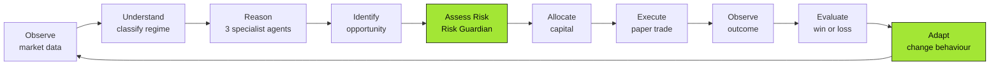

<div align="center">

# 🧠 Autonomous AI Agents for Real-Time Financial Markets

**A self-directing, risk-controlled, multi-agent trading system.**
It observes markets, reasons about them, decides, acts, checks whether it was right — and changes its own behaviour when it wasn't.

[](https://python.org)
[](https://fastapi.tiangolo.com)
[](https://react.dev)
[](https://typescriptlang.org)
[](#-testing)
[](#)

**⚠️ No real money. No real broker. No real orders. Ever.**

</div>

---

## 🎯 The Problem

Most "AI trading bots" share the same fatal flaw: **they let the AI decide how much money to spend.**

An LLM that hallucinates a number is an LLM that can empty an account. That is why serious finance cannot just bolt a chatbot onto a brokerage API — you cannot audit a hunch, and you cannot put "the model felt bullish" in front of a regulator.

**Our answer: let the AI think, but never let it hold the wallet.**

This project separates the two completely. Every rupee of every decision is computed by deterministic, reproducible, testable Python. The AI's only job is to *explain* a decision that has already been finalised. The safety layer is not a prompt — it is code the AI structurally cannot reach.

---

## 🔄 What It Actually Does

The system runs a continuous autonomous loop. Not a script — a real feedback cycle, where the outcome of past trades measurably changes future ones.



---

## ✨ What's Built

Everything below is **implemented and working**, not planned.

| # | Component | What it does |
|---|---|---|
| 1 | **Market Data Engine** | Simulated live prices for 6 assets across 3 markets, with scripted event injection |
| 2 | **Market Router** | Reads an event and routes it to the right specialist — equity, forex, or commodity |
| 3 | **Regime Detector** | Classifies conditions into 6 states: `NORMAL` · `TRENDING` · `HIGH_VOLATILITY` · `LOW_LIQUIDITY` · `EVENT_DRIVEN` · `CRISIS` |
| 4 | **3 Specialist Agents** | Each scores opportunities with market-specific signals and weights — deterministic, no LLM |
| 5 | **Decision Coordinator** | Resolves cross-market conflicts (e.g. a strong USD contradicting a bullish gold call) |
| 6 | 🛡️ **Risk Guardian** | The only thing that can authorise capital. `APPROVE` / `MODIFY` / `REJECT`. **Zero LLM code.** |
| 7 | **Capital Allocator** | Splits available cash across the cycle's opportunities, confidence and risk weighted, keeping a 15% reserve |
| 8 | **Paper Execution** | Simulates realistic fills with slippage and transaction costs |
| 9 | **Portfolio Manager** | Cash, positions, exposure, realised and unrealised P&L |
| 10 | **Outcome Monitor** | Grades every executed trade ~3 cycles later against what was expected |
| 11 | **Strategy Memory** | Win/loss tally per `(strategy, regime)` pair |
| 12 | 🔧 **Adaptation Engine** | **Genuinely changes future behaviour** after losses — and restores it as performance recovers |
| 13 | **Live Operations Console** | 10-page React dashboard, real-time over WebSocket |

---

## 🏆 The Three Claims That Make This Different

### 1. The AI explains — it never decides

```
Deterministic scoring  ──►  action + confidence + ₹ amount   ← the money decision
                                      │
                                      ▼
                            LLM rewrites it in English       ← the only AI involvement
```

The action, the confidence and the allocation are computed in `agents/base_agent.py` by pure arithmetic. The LLM (Groq) receives an **already-final** decision and is asked only to phrase it well. If the API key is missing, the network fails, or the model returns malformed output, the system silently falls back to rule-based templates **and keeps running**.

The `ai_provider_used` field records which one *actually* ran — so the UI can never claim LLM involvement that did not happen.

> 💡 **Why this matters in a pitch:** every money decision is reproducible, auditable and unit-testable. Run it twice, get the same answer. Try that with a prompt.

### 2. The Risk Guardian cannot be bypassed

Plain deterministic Python, sitting between every proposal and every rupee. It enforces:

| Limit | Value |
|---|---|
| Max single trade | ₹20,000 |
| Max exposure to one asset | 25% of portfolio |
| Max total market exposure | 80% of portfolio |
| Daily loss circuit breaker | 5% |
| Max simultaneous positions | 8 |
| Minimum liquidity to trade | 0.3 |
| `CRISIS` regime | New positions blocked entirely |
| Emergency Stop | All new positions blocked, exits still allowed |

It does not merely approve or reject — it **modifies**, cutting a ₹15,360 request down to the ₹5,395 actually permitted. You can watch that happen live on the Risk page.

> 🔒 **A structural guarantee, not a policy.** There is no code path from the AI layer to the money that skips this file. Covered by 20 unit tests.

### 3. Adaptation is real, not cosmetic

After a run of losses **in a given regime**, the Adaptation Engine lowers three multipliers that are genuinely consumed by later decisions:

```
confidence × 0.85     position size × 0.80     risk limits × 0.85
```

Watch it live: the confidence multiplier drops `1.00 → 0.85 → 0.72` across a demo, position sizes visibly shrink, and the Risk Guardian's own ceilings tighten along with them. When performance recovers the multipliers ease back up — capped, so winning never earns more rope than the system started with.

> 📉 It is honest about what it is: a moving win-rate over a lookback window — statistics, not model retraining. That is the right scope for a hackathon, and it *measurably changes later behaviour*, which is the part that counts.

---

## 🎬 Demo Scenarios

Seven replayable scenarios, each exercising a real code path rather than faking a good-looking chart.

| Scenario | What you watch happen |
|---|---|
| 🟢 **Normal Market** | A clean opportunity flowing through the entire pipeline, start to finish |
| 💥 **Sudden Price Shock** | Regime flips to `CRISIS`; the agent stands down and the Guardian blocks new entries |
| 🛑 **Safety Limit Reached** | The AI keeps asking for more of one asset — approved, then cut down, then refused |
| 💧 **Liquidity Drop** | Buyers vanish; the system recognises it cannot exit cheaply and shrinks or halts trades |
| 📰 **Negative News** | Good news leads to a buy, then bad news turns the agent bearish and it cuts the position |
| 📊 **High Price Activity** | Sustained choppiness; every approved trade is halved while it lasts |
| 📉 **Strategy Underperformance** | Repeated losses, and the system notices its own failure and tightens itself |

**Suggested 3-minute pitch route:** `Safety Limit Reached` → `Strategy Underperformance` → `Sudden Price Shock`. That is the safety claim, the autonomy claim, and the crisis response, in that order.

---

## 🖥️ The Dashboard

Ten pages, one shared state provider — so no two pages can ever disagree about the same decision — live over WebSocket.

| Page | Shows |
|---|---|
| **Overview** | What the system is seeing, deciding and doing right now |
| **Markets** | All 6 assets: prices, volatility, liquidity, regime |
| **Agents** | Each specialist's reasoning and confidence |
| **Portfolio** | Cash, holdings, exposure, P&L chart |
| **Risk Controls** | Every limit, and every verdict the Guardian issued |
| **Decisions** | The full pipeline for a single decision, stage by stage |
| **Execution** | Fills, slippage, transaction costs |
| **Adaptation** | Before and after settings, and *why* they changed |
| **Activity** | A plain-English operations log |
| **Settings** | Scenario picker and system controls |

Every metric has a hover explanation, every raw ticker is expanded to a full name, and all plain-English wording lives in one file (`utils/vocab.ts`) so terminology never drifts between pages.

---

## 🌍 Prototype vs. The Real World

Being straight about what is simulated is more convincing than pretending otherwise — and the gap is smaller than it looks, because it is isolated to the edges of the system.

| | 🧪 This Prototype | 🌐 Production System |
|---|---|---|
| **Price data** | Seeded random walk (`data_engine.py`) | Live exchange feed — NSE/NASDAQ via Bloomberg, Refinitiv, or a broker API |
| **News** | Hand-written headlines on scripted cycles | Reuters/Bloomberg wires, regulatory filings, earnings calendars — arriving unpredictably |
| **News understanding** | Keyword signals planted deliberately | Real NLP/LLM sentiment and relevance scoring |
| **Portfolio truth** | A row in a local SQLite file | Your account at a licensed broker, updated only after a trade clears |
| **Trades** | Update a database row instantly | Routed to an exchange, matched against real counterparties, T+1/T+2 settlement |
| **Money** | ₹100,000, invented | Real capital, real bank rails |
| **Pace** | Only when you click Start or Step | Nonstop during market hours, thousands of ticks per second |
| **Authentication** | None — localhost only | OAuth broker tokens, 2FA, secrets manager, HTTPS, full audit trail |
| **Oversight** | None needed | SEBI / SEC regulated, mandatory audits and incident reporting |

### 🔑 Why the gap is narrower than it looks

The **entire simulation lives in one file** — `market/data_engine.py`. Everything downstream (routing, agents, coordination, risk, allocation, execution accounting, outcome grading, adaptation) is written against a generic `MarketEvent` contract and neither knows nor cares where the numbers came from.

```
   ┌──────────────────────┐
   │   data_engine.py     │   ← swap THIS for a real broker feed
   │   (the only fake)    │
   └──────────┬───────────┘
              │  MarketEvent
              ▼
   ┌──────────────────────────────────────────┐
   │  Router → Agents → Coordinator →         │   ← all of this is
   │  Risk Guardian → Allocator → Executor →  │      production-shaped
   │  Monitor → Memory → Adaptation           │      already
   └──────────────────────────────────────────┘
```

**The decision-making brain is the deliverable. The market is the stub.** That is a deliberate architectural choice, not a shortcut — it let us prove the hard part (safe, adaptive, auditable autonomy) without first solving the boring part (paying for a market data licence).

---

## 🔐 Security Posture

**Today, as a local prototype:** there is exactly one secret — a Groq API key in a gitignored `.env`. There is no login, no personal data, no real money, and the server binds to `localhost`. Nothing here is at risk.

**What production would require** — and we are clear-eyed that none of it exists yet:

- 🔑 **OAuth broker tokens**, never passwords — short-lived and revocable
- 🗄️ **A secrets manager** (Vault, AWS Secrets Manager), not a plaintext file
- 🔒 **HTTPS everywhere** and locked-down CORS (currently `*`, for local dev)
- 👤 **Authentication and authorization** on every endpoint
- 📱 **2FA and confirmation steps** before any money movement
- 📜 **Immutable audit logs** for regulatory inspection

---

## 🚀 Roadmap

### Near-term
- [ ] **Reduce LLM token spend** — enrich only *actionable* decisions, not the ~6 routine HOLDs per cycle. Would multiply effective throughput on the free tier.
- [ ] **Persist cycle history** (`GET /api/history`) so the portfolio chart survives a page refresh
- [ ] **Paginate `/api/decisions`** for long-running sessions
- [ ] **Widen test coverage** to the engine, allocator and executor

### Medium-term
- [ ] 🔌 **Real market data adapter** — swap `data_engine.py` for a live feed; the architecture is already shaped for it
- [ ] 📰 **Real news ingestion** with LLM-based sentiment scoring
- [ ] 📈 **Backtesting mode** — replay years of historical data to validate strategies before going anywhere near live
- [ ] 🎯 **Per-asset deep-dive routes** (`/markets/:asset`)

### Long-term
- [ ] 🏦 **Broker integration behind a hard human-approval gate** — OAuth, and never autonomous execution with real capital on day one
- [ ] 🧠 **Learned adaptation** — replace the win-rate heuristic with a trained model, while leaving the deterministic Risk Guardian untouched
- [ ] 👥 **Multi-portfolio and multi-user** support with per-user risk profiles
- [ ] 🔍 **Explainability export** — a regulator-ready audit trail for every decision

---

## 🛠️ Tech Stack

**Backend** — Python 3.13 · FastAPI · SQLAlchemy 2.0 · SQLite · WebSockets · httpx · Groq (`openai/gpt-oss-120b`)
**Frontend** — React 19 · TypeScript 6 · Vite 8 · Recharts · hash router
**Testing** — pytest, 41 tests

---

## ⚡ Running It

### 1. Backend

```bash
cd backend
python -m venv .venv
.venv/Scripts/pip install -r requirements.txt
.venv/Scripts/python -m uvicorn main:app --port 8010 --reload
```

On macOS or Linux, use `.venv/bin/pip` and `.venv/bin/python` instead.

*Optional:* copy `.env.example` to `.env` and add a free [Groq](https://console.groq.com) API key for LLM-written explanations. **Not required** — the system runs fine without one, using rule-based templates.

### 2. Frontend

```bash
cd frontend
npm install
npm run dev
```

Open **http://localhost:5173**, then go to **Settings**, pick a scenario, and press **Start**.

### 3. Testing

```bash
cd backend
.venv/Scripts/pip install -r requirements-dev.txt
.venv/Scripts/python -m pytest
```

```bash
cd frontend
npx tsc --noEmit -p tsconfig.app.json
```

---

## 📋 Known Limits

Better stated here than discovered mid-demo:

- **The Groq free tier caps at 8,000 tokens per minute.** A cycle costs roughly 3,000, so during a fast continuous run most explanations fall back to rule-based text. The fallback is by design and is reported honestly through `ai_provider_used`. Use **Step**, or a slower speed, when the LLM prose matters.
- **A holding can drift above its 25% cap** if the price rises after entry — limits are enforced at trade time and there is no forced-sale logic. The Risk page says so plainly rather than hiding it.
- **Chart history is in-memory**, capped at 120 cycles and lost on refresh.
- **`max_single_trade` rarely binds** — agent sizing seldom reaches ₹20,000, so the `MODIFY` verdict is usually demonstrated through the concentration limit instead.

---

<div align="center">

**Built as a hackathon prototype.**
Everything simulated. Nothing real at risk. The architecture is the point.

</div>
